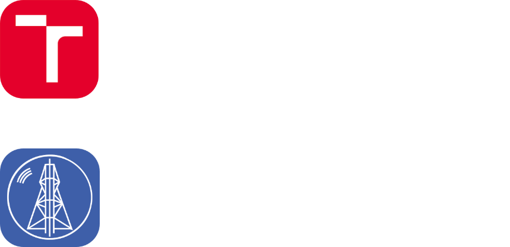

<!-- Generated from README.ts by kramdown-deno -->

<div markdown="1" align="center">

<a href="https://github.com/onegentig" title="Onegen" id="profile-link"></a>

[![profile-title]][profile-link]

Hey-o, I&rsquo;m **Nick Onegen**, a dude who likes computers and other such things! ^^

[![badge-editor-vscode]][vscode] [![badge-editor-nvim]][nvim] [![badge-editor-vs]][vs]
[![badge-editor-arduino]][arduino] \
[![badge-os-fedora]][fedora] [![badge-os-endeavouros]][endeavouros] [![badge-os-windows]][windows]


</div>

![divider]



<div markdown="1" align="left" width="70%">

```yaml
Onegen ~ life version 2.02.4
----------------------------
Name: Nick Onegen
Uptime: 22 years
Kernel: 0.w.0-dev.infj54.foxarch
IDE: VS Code 1.86.0-insider
Env: Fedora 38, GNOME 44.7, zsh 5.9, tmux, starship

Stack.Core:    ● C       ● JavaScript ● C++   ● Rust   
Stack.Scripts: ● Python  ● Bash       
Stack.Low:     ● x86     ● VHDL       
Stack.Web:     ● HTML    ● PHP        ● Vue   ● Hugo   
Stack.Backend: ● Express ● NestJS     ● NAPI  
Stack.Science: ● Jupyter ● NumPy      ● SciPy ● MATLAB 

Socials: @onegen (Discord)
```

</div>

<div markdown="1" align="center">

What am I up to?
----------------

<a href="https://discord.com/users/258681302960701450" title="@onegen on Discord" id="discord"></a>

### Projects ###

| Project | Status | Languages | Description |
| ------- | ------ | --------- | ----------- |
| 🔒&nbsp;[Hexxo] | *work-in-progress* | JavaScript<br>Rust | Personal semi–private Discord bot powered by Sapphire/D.JS with music playback, art galleries, stargazing and a medley of random commands |
| [FIT VUT BIT] assignments | *active* | *many* | Assignments from my CompSci Bachelor's degree at FIT VUT Brno. |


</div>

<div markdown="1" align="center">

Stats
-----

<a href="https://github.com/Ashutosh00710/github-readme-activity-graph" id="stats-graph-link"></a>
\
\
<a href="https://github.com/anuraghazra/github-readme-stats" id="stats-github-link"></a>
<a href="https://github.com/DenverCoder1/github-readme-streak-stats" id="stats-streak-link"></a>
\
\
<a href="https://wakatime.com/" id="stats-wakatime-link"></a>
<a href="https://github.com/ryo-ma/github-profile-trophy" id="stats-trophies-link"></a>

</div>

<!-- Image References -->

[profile-title]: assets/images/title.svg "Onegen written in Roman, Cyrillic and Katakana"
[badge-editor-vscode]: https://img.shields.io/badge/-Visual_Studio_Code-%23007acc?logo=visualstudiocode&labelColor=4c566a&style=flat-square
[badge-editor-nvim]: https://img.shields.io/badge/-Neovim-%23019733?logo=neovim&labelColor=4c566a&style=flat-square
[badge-editor-vs]: https://img.shields.io/badge/-Visual_Studio-%235c2d91?logo=visualstudio&labelColor=4c566a&style=flat-square
[badge-editor-arduino]: https://img.shields.io/badge/-Arduino-%2300979d?logo=arduino&labelColor=4c566a&style=flat-square
[badge-os-fedora]: https://img.shields.io/badge/-Fedora_38-%2351a2da?logo=fedora&labelColor=4c566a&style=flat-square
[badge-os-endeavouros]: https://img.shields.io/badge/-EndeavourOS-%237f7fff?logo=endeavouros&labelColor=4c566a&style=flat-square
[badge-os-windows]: https://img.shields.io/badge/-Windows_10-%230078d6?logo=windows&labelColor=4c566a&style=flat-square
[divider]: assets/images/divider.gif

<!-- Link References -->

[profile-link]: https://github.com/onegentig "Onegen"
[vscode]: https://code.visualstudio.com/ "Visual Studio Code"
[nvim]: https://neovim.io/ "Neovim"
[vs]: https://visualstudio.microsoft.com/ "Visual Studio"
[arduino]: https://www.arduino.cc/ "Arduino"
[fedora]: https://getfedora.org/en/workstation/ "Fedora"
[endeavouros]: https://endeavouros.com/ "EndeavourOS"
[windows]: https://web.archive.org/web/20150801210403/http://www.microsoft.com/en-us/windows "Windows 10"
[discord]: https://discord.com/users/258681302960701450 "@onegen on Discord"
[hexxo]: https://github.com/onegentig/hexxo "Hexxo"
[FIT VUT BIT]: https://github.com/onegentig/VUT-BIT "Projects from BCS studies at FIT VUT, Czechia"
[stats-graph-link]: https://github.com/Ashutosh00710/github-readme-activity-graph
[stats-github-link]: https://github.com/anuraghazra/github-readme-stats
[stats-streak-link]: https://github.com/DenverCoder1/github-readme-streak-stats
[stats-trophies-link]: https://github.com/ryo-ma/github-profile-trophy
[stats-wakatime-link]: https://wakatime.com/
